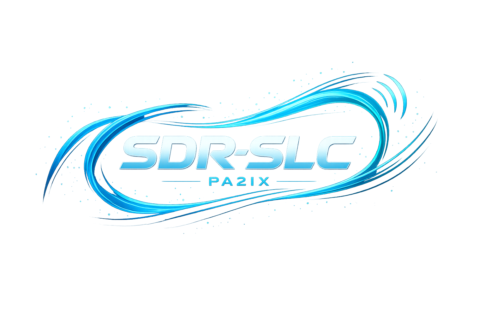

  

# SDR-SLC

SDR-SLC is an open protocol suite for low-cost networked software-defined radio hardware.

The project defines how SDR hardware is:

- discovered on the network
- controlled by clients
- used to stream I/Q samples to host software

The architecture is designed for HAM radio experimenters, home-builders, and developers who want an open alternative to proprietary SDR ecosystems.

---

# Design Goals

- Open protocols
- Low-cost hardware
- Host-side DSP
- Network-native SDR
- Easy implementation on STM32 and Raspberry Pi
- Interoperability between independently developed clients and hardware

---

# Protocol Suite

The SDR-SLC protocol suite consists of four specifications.

| Document | Description |
|---|---|
| SDR-SLC-PS | Protocol Suite Architecture |
| SDR-SLC-DISC | Service Discovery (mDNS/DNS-SD) |
| SDR-SLC-CP | JSON/TCP Control Plane |
| SDR-SLC-VITA | VITA-49 I/Q Stream Transport |

---

# Specification Documents

## SDR-SLC-PS — Protocol Suite Architecture

Overall system architecture, philosophy, slice model, conformance profiles, and hardware model.

[Open PDF](docs/assets/pdf/SDR-SLC-PS-1_0-R1_2.pdf)

---

## SDR-SLC-DISC — Service Discovery

Automatic device discovery using mDNS and DNS-SD.

[Open PDF](docs/assets/pdf/SDR-SLC-DISC-1_0-R1_2.pdf)

---

## SDR-SLC-CP — Control Plane

JSON-over-TCP protocol for capabilities, tuning, stream lifecycle management, RX/TX control, and asynchronous events.

[Open PDF](docs/assets/pdf/SDR-SLC-CP-1_0-R1_3.pdf)

---

## SDR-SLC-VITA — VITA-49 I/Q Transport

UDP transport for I/Q streams using constrained VITA-49 profiles.

[Open PDF](docs/assets/pdf/SDR-SLC-VITA-1_0-R1_2.pdf)

---

# Current Status

Current release status:

- Protocol suite: Release Candidate
- STM32 firmware: internal testing
- Client software: version 1.0 in Apple App Store
- Reference hardware: RTL-SDR dongle, BladeRF, SDR-SDR HF transceiver

---

# Philosophy

SDR-SLC intentionally pushes DSP processing to the host computer rather than embedding complex FPGA DSP pipelines into the radio hardware itself.

This enables:

- simpler hardware
- lower cost
- easier experimentation
- fully programmable DSP
- easier home-built SDR implementations

---

# Target Hardware

The protocol suite is specifically designed to be implementable on:

- STM32H7 microcontrollers
- Raspberry Pi systems
- Tayloe detector front-ends
- low-cost Ethernet-capable SDR hardware

---

# Intended Audience

- HAM radio experimenters
- SDR developers
- embedded developers
- DSP developers
- protocol implementers
- home-builders

---

# Author

Ivo van Ling, PA2IX  
IXChange BV

HAM radio blog:

https://pa2ix.vanling.net

---

# License

Documentation is published under:

Creative Commons Attribution 4.0 International (CC BY 4.0)
